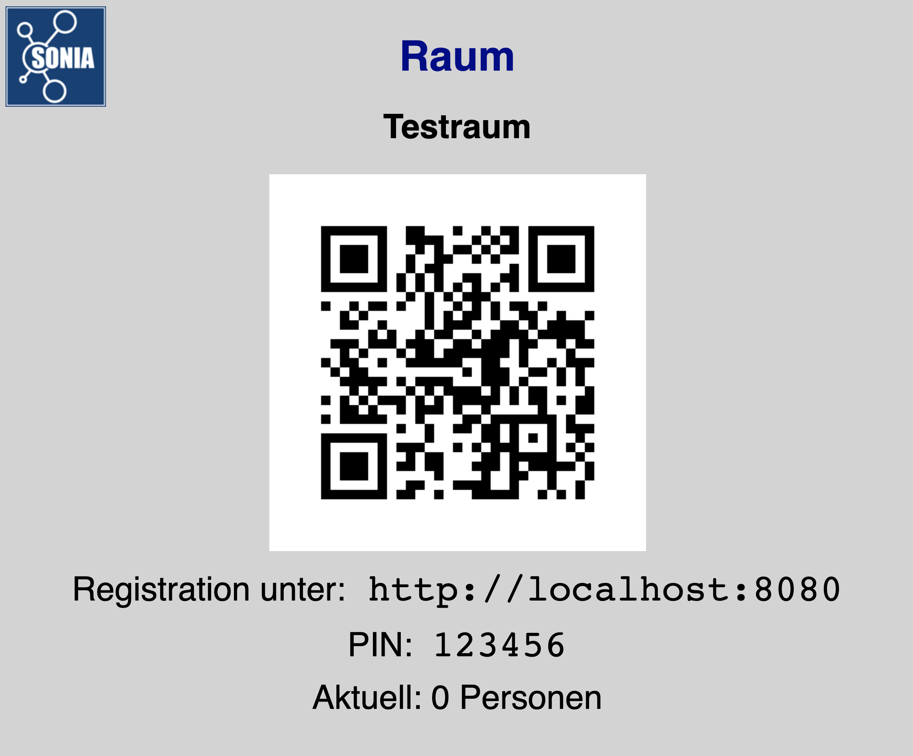
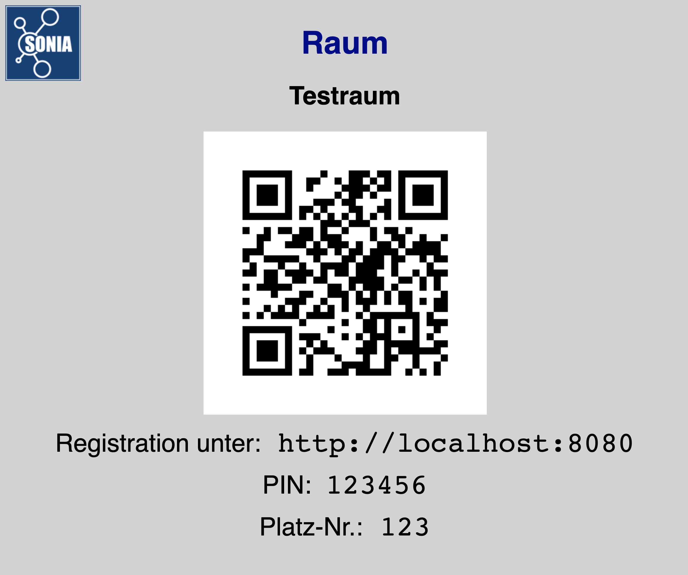
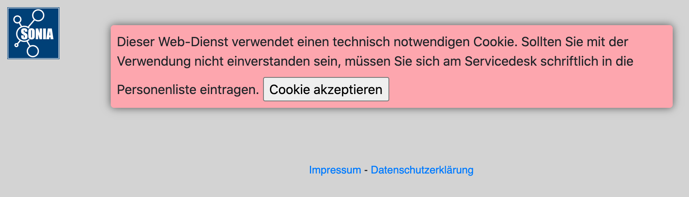
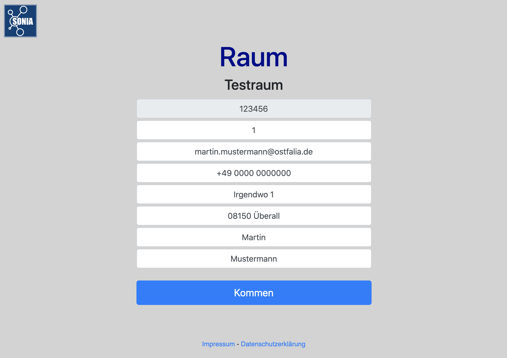
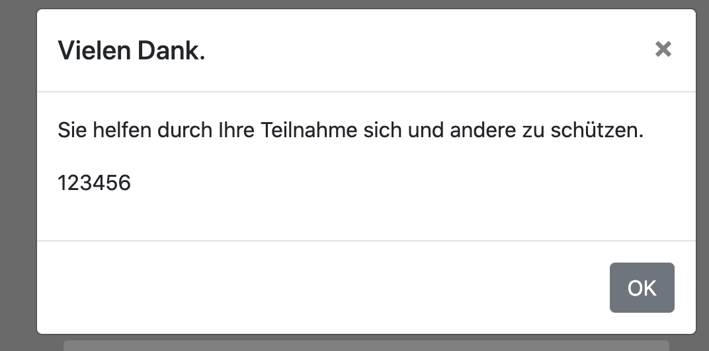
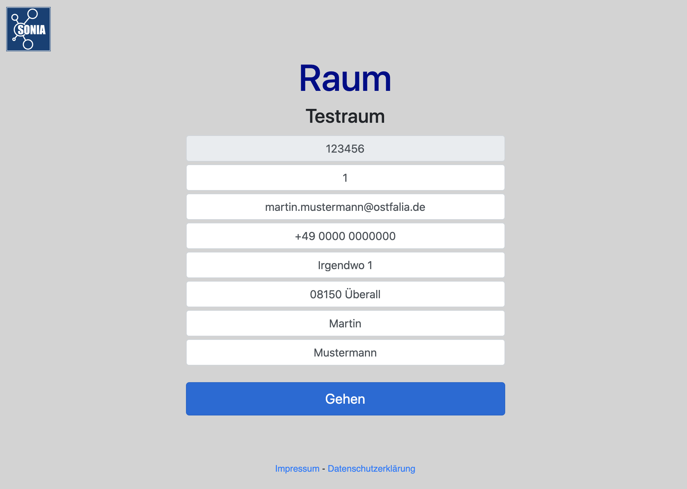
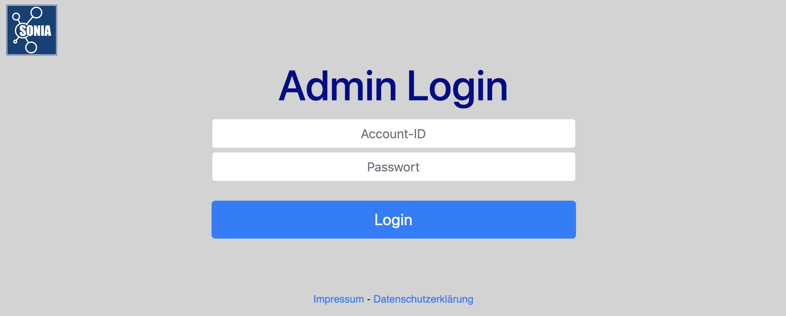
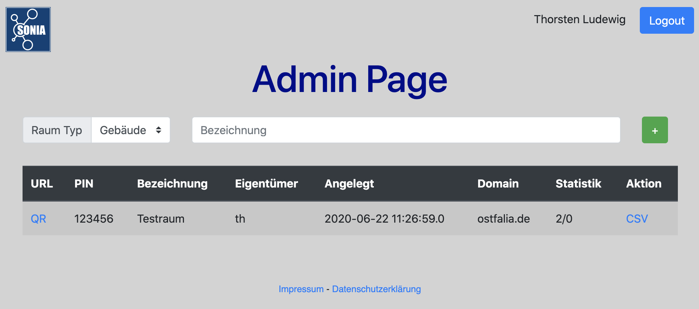
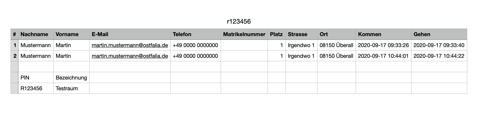
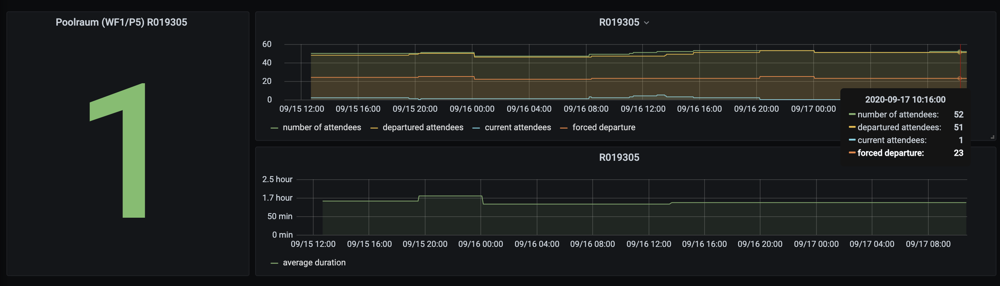

# QR-Travel

## Aushang für einen Raum

URL: `<service url>/view?p=<pin>`

Beispiel: `http://localhost:8080/view?p=123456`

## Aushang für einen Raum und Platz

URL: `<service url>/view?p=<pin>&l=<platz>`

Beispiel: `http://localhost:8080/view?p=123456&l=123`

## Service Startseite

URL: `<service url>/`

## Registrationsseite

## Admin Login

URL: `<service url>/sys/login`

## Admin Seite

URL: `<service url>/admin`

## CSV Export

## Grafana Statistik

Statistik eines Poolraumes

